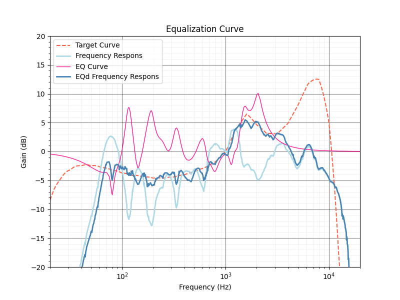
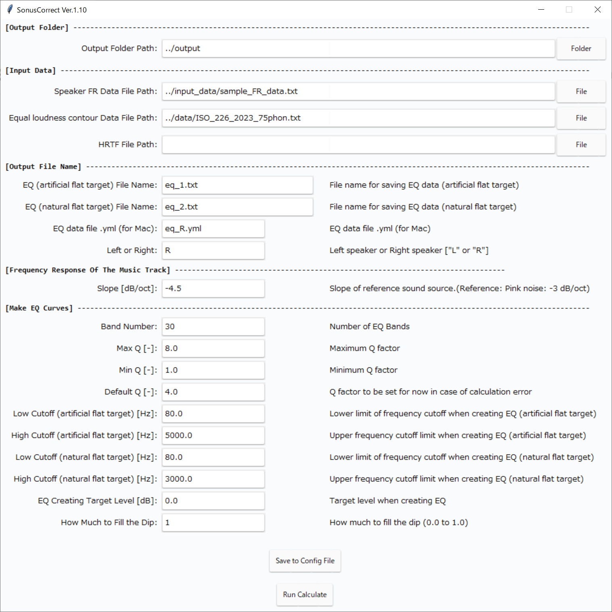

# SONUS CORRECT

[関連記事一覧](https://quickwaipa.com/sonus_correct/sonus_correct.html)
    
[English README is here](https://github.com/quick-waipa/SONUS_CORRECT/blob/main/README_ENG.md)  
    
***
- Ver.1.10 2025/09/22
   - MacOS用の出力データ(.ymlファイル)を作成出来るようにした
- Ver.1.00 2025/09/15
   - 新規リリース
- テスト環境: 
   - Windows 10 22H2 (Python 3.11.5)
  
***
## 説明：

音楽的な聞き心地の良さと音場補正の成立性を理論的に完全に両立した、筆者独自の考え方に基づく音場補正用EQデータ作成プログラムです。
従来の音場補正では単純なフラット特性（これを「人為的フラットターゲット」と呼んでいます）をターゲットにイコライジングしており、結果として補正後の音が曇ったり引っ込んだりして聞こえる傾向がありました。このプログラムでは等ラウドネス曲線を考慮した「ナチュラルフラットターゲット」を加味することで、より「音楽的に聴き心地の良い」補正が可能となっています。

基本的な使い方は以下の通りです。

- まず、インプットデータとしてスピーカーの周波数特性データを用意する（周波数[Hz]、ゲイン[dB]、カンマ区切りデータファイル）。注：20Hz～20000Hzのデータがないとエラーになります。
- SonusCorrect.exeを起動し、各種入力を設定する。
- 「Run Calculate」ボタンを押して計算を実行。アウトプットとして以下が出力されます。

  - EQデータファイル（人為的フラットのターゲット）:EQ (artificial flat target) File Name
  - EQデータファイル（ナチュラルフラットのターゲット）:EQ (natural flat target) File Name
  - プロットグラフ（人為的フラットのターゲット）:plot_artificial_flat_target.png
  - プロットグラフ（ナチュラルフラットのターゲット）:plot_natural_flat_target.png
  - Frequency Response Integral:FRIの計算結果:fri.txt

- Equalizer APOなどのソフトでEQデータファイルを適用します。

ここで、2種類のEQデータファイルについて説明します。
EQデータファイルは以下の2種類が出力されます。

- 人為的フラットターゲットに対する音場補正用EQデータ
- ナチュラルフラットターゲットに対する音場補正用EQデータ

この2種類のEQによる補正を適切な割合でミックスすることで、より良い音場補正が実現できる、という考えです。
たとえばEqualizer APOでは入力音声を二つにわけてそれぞれ異なったEQを適用し、再度ミックスする、ということが可能です。
ミックスする際、ゲイン調整のためにfri.txtに記載されたFRIの変化値を参考にしてください。

***
## インストールが必要なライブラリ：
以下のライブラリをインストールしてください。

- pandas 
- yaml 
- tkinter 
- ttkthemes 
- numpy 
- scipy  
- matplotlib

インストールには以下のバッチファイル/シェルをご利用下さい。
- Windows: install.bat
- Linux系: install.sh

***
## プログラムの実行：
プログラムの実行コマンドは以下です。  

`py ./SonusCorrect.py`  
もしくは
`python ./SonusCorrect.py`  
`python3 ./SonusCorrect.py`  

また以下で実行ファイルを作成できます。  
- Windows: build.bat  
- Linux: `sh ./build.sh`  

注：`config.yaml`は実行ファイルと同じフォルダに入れてください。  

***
## 入力データ：
各入力データについて説明します。 

#### [Output Folder]
 + **Output Folder Path:** 出力されるファイルを格納するフォルダのパスを入力して下さい
 
#### [Input Data]
 + **Speaker FR Data File Path:** データ形式：Hz, Gain：カンマ区切り。スピーカーの周波数特性データのファイルパスを入力して下さい。なお、20Hz～20000Hzのデータがないとエラーになります。
 + **Filter Data File Path:** データ形式：Hz, Gain：カンマ区切り。等ラウドネス曲線のファイルパスを入力して下さい。ISO 226:2023の75phonにおけるデータを用意してあります(ISO_226_2023_75phon.txt)。※データのライセンスについては"LICENSE"参照。
 + **HRTF File Path:** データ形式：Hz, Gain：カンマ区切り。ヘッドフォンの補正をする場合にのみ入力して下さい。頭部伝達関数(HRTF)のファイルパスを入力して下さい。
 
#### [Output File Name]
 + **EQ(artificial flat target)File Name:** 出力データ（人為的フラットターゲットのEQデータ）のファイル名（任意）
 + **EQ(natural flat target)File Name:** 出力データ（ナチュラルフラットターゲットのEQデータ）のファイル名（任意）
 + **EQ data file .yml(for Mac):** 出力データ（.yml形式のEQデータ）のファイル名（任意）
 + **Left or Right:** スピーカーの左右（"L"もしくは"R"を入力）
 
#### [Application of Characteristic Filter to Frequency Response]
 + **Slope [dB/oct]:** 普段聴く楽曲の周波数特性のスロープを設定（推奨値：3～5程度）。
 
#### [Make EQ Curve]
 + **Band Number:** EQデータのバンド数を入力（推奨値：30程度）。
 + **Max Q [-]:** EQのQ値の最大値（推奨値：8程度）。
 + **Min Q [-]:** EQのQ値の最大値（推奨値：1程度）。
 + **Default Q [-]:** ガウス関数のフィッティングが上手くいかなかったときに設定するQ値（推奨値：4程度）。
 + **Low Cutoff(artificial flat target) [Hz]:** EQを作成する周波数域の下限（人為的フラットターゲット）（推奨値：60～120Hz程度）
 + **High Cutoff(artificial flat target) [Hz]:** EQを作成する周波数域の上限（人為的フラットターゲット）（推奨値：3000～10kHz程度）
 + **Low Cutoff(natural flat target) [Hz]:** EQを作成する周波数域の下限（ナチュラルフラットターゲット）（推奨値：60～120Hz程度）
 + **High Cutoff(natural flat target) [Hz]:** EQ（ナチュラルフラットターゲット）EQを作成する周波数域の上限（ナチュラルフラットターゲット）（推奨値：3000～10kHz程度）
 + **EQ Creating Target Level [dB]:** EQを作成する際のターゲットレベル（デフォルト：0dB）
 + **How Much to Fill the Dip:** ディップをどの程度埋めるか（0.0：ディップを埋めない～1.0：ディップを埋める）
 
#### [人為的フラットターゲットとナチュラルフラットターゲットのEQデータの比率の計算]
人為的フラットターゲットのEQとナチュラルフラットターゲットのEQの比率を反映するには以下の計算式を用います。

Gain_{artificial }=10log_{10}(\alpha)+3 
Gain_{natural}=10log_{10}(1-\alpha)+3

以下にαの値とそれに対応するGainの値を表にして示します。

|α|1-α|Gain_artificial[dB]|Gain_natural[dB]|
| ---- | ---- |---- |---- |
|0.00|1.00|-∞|3.00| 
|0.05|0.95|-10.01|2.78| 
|0.10|0.90|-7.00|2.54| 
|0.15|0.85|-5.24|2.29| 
|0.20|0.80|-3.99|2.03| 
|0.25|0.75|-3.02|1.75| 
|0.30|0.70|-2.23|1.45| 
|0.35|0.65|-1.56|1.13| 
|0.36|0.64|-1.44|1.06| 
|0.37|0.63|-1.32|0.99| 
|0.38|0.62|-1.20|0.92| 
|0.39|0.61|-1.09|0.85| 
|0.40|0.60|-0.98|0.78| 
|0.41|0.59|-0.87|0.71| 
|0.42|0.58|-0.77|0.63| 
|0.43|0.57|-0.67|0.56| 
|0.44|0.56|-0.57|0.48| 
|0.45|0.55|-0.47|0.40| 
|0.46|0.54|-0.37|0.32| 
|0.47|0.53|-0.28|0.24|
|0.48|0.52|-0.19|0.16| 
|0.49|0.51|-0.10|0.08|
|0.50|0.50|-0.01|-0.01| 
|0.51|0.49|0.08|-0.10| 
|0.52|0.48|0.16|-0.19| 
|0.53|0.47|0.24|-0.28| 
|0.54|0.46|0.32|-0.37| 
|0.55|0.45|0.40|-0.47| 
|0.56|0.44|0.48|-0.57| 
|0.57|0.43|0.56|-0.67| 
|0.58|0.42|0.63|-0.77| 
|0.59|0.41|0.71|-0.87| 
|0.60|0.40|0.78|-0.98| 
|0.61|0.39|0.85|-1.09| 
|0.62|0.38|0.92|-1.20| 
|0.63|0.37|0.99|-1.32| 
|0.64|0.36|1.06|-1.44| 
|0.65|0.35|1.13|-1.56| 
|0.70|0.30|1.45|-2.23| 
|0.75|0.25|1.75|-3.02| 
|0.80|0.20|2.03|-3.99| 
|0.85|0.15|2.29|-5.24| 
|0.90|0.10|2.54|-7.00| 
|0.95|0.05|2.78|-10.01| 
|1.00|0.00|3.00|-∞|

***
## コツなど：
- フィルター後のターゲットは5000Hz以上のピークには合わせすぎない方がいいかもしれません。合わせるとかなり煌びやかになります。
- ディップをどの程度埋めるかは適宜判断が必要です。
- 特にヘッドフォンの場合はディップは必要上存在している場合があるので埋めすぎない方が良い場合があります。
- αを極端な値（0と1）に設定しても音楽的に聴けるような調整が妥当です。
- 測定によって結果が大きく変わります。複数回行って平均化することが効果的です。
 
***
## 作成者：
- クイック賄派
- HP: https://quickwaipa.com
- E-Mail: quickwaipa@quickwaipa.com

## ライセンス
Copyright (c) 2024-2025 Quick-Waipa  
This software is released under the MIT License, see LICENSE.
