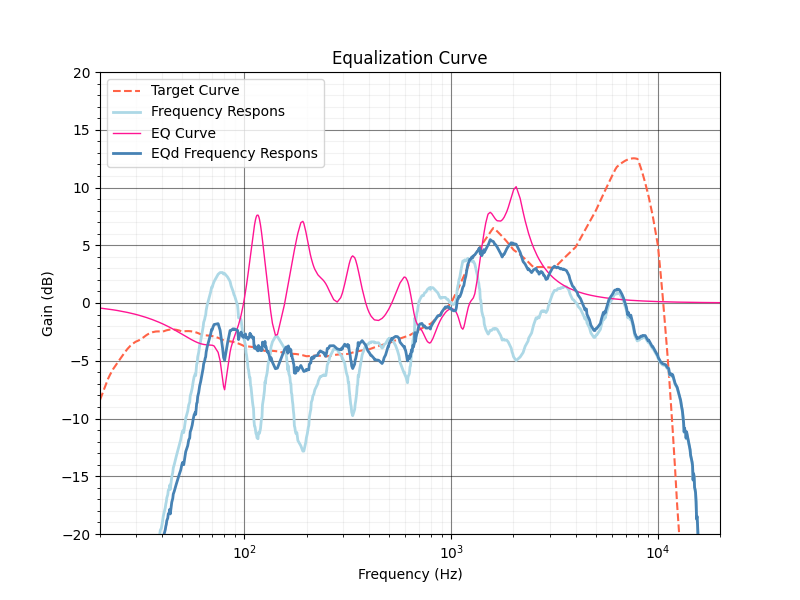

# SONUS CORRECT

[Related Articles](https://quickwaipa.com/sonus_correct/sonus_correct.html)

[日本語版 README はこちら](https://github.com/quick-waipa/SONUS_CORRECT/blob/main/README.md)  
    
***
- Ver.1.11 2025/10/04
   - Revised calculation formula for gain values corresponding to α values
- Ver.1.10 2025/09/22
   - Added support for generating output data (.yml files) for macOS
- Ver.1.00 2025/09/15
   - New Release
- Test Environment: 
   - Windows 10 22H2 (Python 3.11.5)
  
***
## Description:

This is a sound field correction EQ data creation program based on a unique concept that theoretically achieves both musical listening comfort and correction accuracy.
Conventional sound field correction targets a simple flat response (referred to as an “artificial flat target”) for equalization, often resulting in a muddy or recessed sound after correction. This program incorporates a “natural flat target” that considers equal loudness contours, enabling a more “musically pleasing” correction.

The basic usage is as follows:

- First, prepare the speaker's frequency response data as input data (frequency [Hz], gain [dB], comma-separated data file). Note: An error will occur if data between 20Hz and 20000Hz is missing.
- Launch SonusCorrect.exe and configure the various inputs.
- Press the “Run Calculate” button to execute the calculation. The following outputs will be generated:

  - EQ data file (artificial flat target): EQ (artificial flat target) File Name
  - EQ data file (natural flat target): EQ (natural flat target) File Name
  - Plot graph (artificial flat target): plot_artificial_flat_target.png
  - Plot graph (natural flat target): plot_natural_flat_target.png
  - Frequency Response Integral (FRI) calculation result: fri.txt

- Apply the EQ data files using software like Equalizer APO.

Here, we explain the two types of EQ data files.
Two types of EQ data files are output:

- EQ data for sound field correction against the artificial flat target
- EQ data for sound field correction against the natural flat target

The idea is that mixing these two types of EQ corrections in appropriate proportions can achieve better sound field correction.
For example, Equalizer APO allows splitting the input audio into two channels, applying different EQs to each, and then mixing them back together.
When mixing, refer to the FRI change values listed in fri.txt for gain adjustment.

***
## Required Libraries:
Please install the following libraries.

- pandas 
- yaml 
- tkinter 
- ttkthemes 
- numpy 
- scipy  
- matplotlib

Please use the following batch file/shell script for installation.
- Windows: install.bat
- Linux: install.sh

***
## Running the Program:  
The program execution commands are as follows.  

`py ./SonusCorrect.py`  
or  
`python ./SonusCorrect.py`  
`python3 ./SonusCorrect.py`  

You can also create an executable file using the following:  
- Windows: build.bat  
- Linux: `sh ./build.sh`  

Note: Place `config.yaml` in the same folder as the executable file.  

***
## Input Data:
Each input data point is described below. 

#### [Output Folder]
 + **Output Folder Path:** Enter the path to the folder where output files will be stored
 
#### [Input Data]
 + **Speaker FR Data File Path:** Data format: Hz, Gain: comma-separated. Enter the file path for the speaker frequency response data. Note: Data must cover 20Hz to 20000Hz; otherwise, an error will occur.
 + **Filter Data File Path:** Data format: Hz, Gain: comma-separated. Enter the file path for the equal loudness contour data. Data for ISO 226:2023 at 75 phon is provided (ISO_226_2023_75phon.txt). ※Refer to “LICENSE” for data licensing.
 + **HRTF File Path:** Data format: Hz, Gain: comma-separated. Enter only when performing headphone correction. Enter the file path for the Head-Related Transfer Function (HRTF).
 
#### [Output File Name]
 + **EQ(artificial flat target)File Name:** Output data filename (artificial flat target EQ data) (optional)
 + **EQ(natural flat target)File Name:** Output data filename (natural flat target EQ data) (optional)
 + **EQ data file .yml (for Mac):** Output data filename (in .yml format for EQ data) (optional)
 + **Left or Right:** Speaker side (enter “L” or “R”)
 
#### [Application of Characteristic Filter to Frequency Response]
 + **Slope [dB/oct]:** Set the slope for the frequency response of music you typically listen to (recommended value: around 3 to 5).
 
#### [Make EQ Curve]
 + **Band Number:** Enter the number of bands for the EQ data (recommended value: around 30).
 + **Max Q [-]:** The maximum Q value for the EQ (recommended value: around 8).
 + **Min Q [-]:** The minimum Q value for the EQ (recommended value: around 1).
 + **Default Q [-]:** Q value to use when Gaussian function fitting fails (recommended value: around 4).
 + **Low Cutoff(artificial flat target) [Hz]:** Lower limit of the frequency range for EQ creation (artificial flat target) (recommended value: around 60–120Hz)
 + **High Cutoff(artificial flat target) [Hz]:** Upper limit of the frequency range for EQ creation (artificial flat target) (Recommended value: 3000–10kHz)
 + **Low Cutoff(natural flat target) [Hz]:** Lower limit of the frequency range for EQ creation (natural flat target) (Recommended value: 60–120Hz)
 + **High Cutoff (natural flat target) [Hz]:** Upper limit of the frequency range for creating the EQ (natural flat target) (Recommended value: approx. 3000–10kHz)
 + **EQ Creating Target Level [dB]:** Target level when creating the EQ (Default: 0dB)
 + **How Much to Fill the Dip:** How much to fill the dip (0.0: Do not fill the dip ~ 1.0: Fill the dip)
 
Calculation of the Ratio Between Artificial Flat Target and Natural Flat Target EQ Data
To reflect the ratio between the artificial flat target EQ and the natural flat target EQ, use the following calculation formula:

Gain_{artificial }=6log_{2}(\alpha) 
Gain_{natural}=6log_{2}(1-\alpha)

The table below shows the values of α and the corresponding Gain values.

|α|1-α|Gain_artificial[dB]|Gain_natural[dB]|
| ---- | ---- |---- |---- |
|	0.00 	|	1.00 	|	-∞	|	0.00 	|
|	0.05 	|	0.95 	|	-25.93 	|	-0.44 	|
|	0.10 	|	0.90 	|	-19.93 	|	-0.91 	|
|	0.15 	|	0.85 	|	-16.42 	|	-1.41 	|
|	0.20 	|	0.80 	|	-13.93 	|	-1.93 	|
|	0.25 	|	0.75 	|	-12.00 	|	-2.49 	|
|	0.30 	|	0.70 	|	-10.42 	|	-3.09 	|
|	0.35 	|	0.65 	|	-9.09 	|	-3.73 	|
|	0.36 	|	0.64 	|	-8.84 	|	-3.86 	|
|	0.37 	|	0.63 	|	-8.61 	|	-4.00 	|
|	0.38 	|	0.62 	|	-8.38 	|	-4.14 	|
|	0.39 	|	0.61 	|	-8.15 	|	-4.28 	|
|	0.40 	|	0.60 	|	-7.93 	|	-4.42 	|
|	0.41 	|	0.59 	|	-7.72 	|	-4.57 	|
|	0.42 	|	0.58 	|	-7.51 	|	-4.72 	|
|	0.43 	|	0.57 	|	-7.31 	|	-4.87 	|
|	0.44 	|	0.56 	|	-7.11 	|	-5.02 	|
|	0.45 	|	0.55 	|	-6.91 	|	-5.17 	|
|	0.46 	|	0.54 	|	-6.72 	|	-5.33 	|
|	0.47 	|	0.53 	|	-6.54 	|	-5.50 	|
|	0.48 	|	0.52 	|	-6.35 	|	-5.66 	|
|	0.49 	|	0.51 	|	-6.17 	|	-5.83 	|
|	0.50 	|	0.50 	|	-6.00 	|	-6.00 	|
|	0.51 	|	0.49 	|	-5.83 	|	-6.17 	|
|	0.52 	|	0.48 	|	-5.66 	|	-6.35 	|
|	0.53 	|	0.47 	|	-5.50 	|	-6.54 	|
|	0.54 	|	0.46 	|	-5.33 	|	-6.72 	|
|	0.55 	|	0.45 	|	-5.17 	|	-6.91 	|
|	0.56 	|	0.44 	|	-5.02 	|	-7.11 	|
|	0.57 	|	0.43 	|	-4.87 	|	-7.31 	|
|	0.58 	|	0.42 	|	-4.72 	|	-7.51 	|
|	0.59 	|	0.41 	|	-4.57 	|	-7.72 	|
|	0.60 	|	0.40 	|	-4.42 	|	-7.93 	|
|	0.61 	|	0.39 	|	-4.28 	|	-8.15 	|
|	0.62 	|	0.38 	|	-4.14 	|	-8.38 	|
|	0.63 	|	0.37 	|	-4.00 	|	-8.61 	|
|	0.64 	|	0.36 	|	-3.86 	|	-8.84 	|
|	0.65 	|	0.35 	|	-3.73 	|	-9.09 	|
|	0.70 	|	0.30 	|	-3.09 	|	-10.42 	|
|	0.75 	|	0.25 	|	-2.49 	|	-12.00 	|
|	0.80 	|	0.20 	|	-1.93 	|	-13.93 	|
|	0.85 	|	0.15 	|	-1.41 	|	-16.42 	|
|	0.90 	|	0.10 	|	-0.91 	|	-19.93 	|
|	0.95 	|	0.05 	|	-0.44 	|	-25.93 	|
|	1.00 	|	0.00 	|	0.00 	|	-∞	|

***
## Tips:
- After filtering, it's best not to over-adjust the target to peaks above 5000Hz. Doing so can make the sound quite flashy.
- Decide how much to fill in dips based on the situation.
- Especially with headphones, dips may be necessary, so it's sometimes better not to fill them in too much.
- Even when setting α to extreme values (0 and 1), adjustments that sound musical are appropriate.
- Results can vary significantly depending on the measurement. It's effective to perform multiple measurements and average them.
 
***
## Auther：
- Quick Waipa
- HP: https://quickwaipa.com
- E-Mail: quickwaipa@quickwaipa.com

## License
Copyright (c) 2024-2025 Quick-Waipa  
This software is released under the MIT License, see LICENSE.

